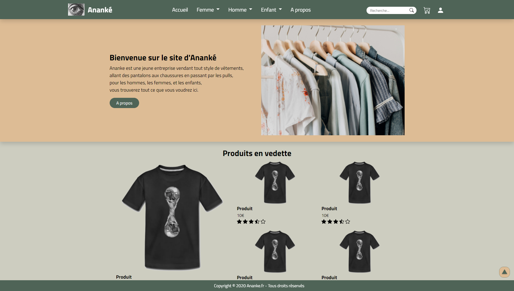

# Ananké
  
Projet de substitution du stage de fin d'année du DUT Informatique.  
Création d'une boutique en ligne de vêtements avec gestions des produits, des commentaires et notes, des comptes clients et des paiements.  
[Démo du site](https://dut.minarox.fr/ananke/)

## Sommaire
* [Fonctionnalités](https://github.com/dut-informatique/ananke#fonctionnalit%C3%A9s)
* [Administration](https://github.com/dut-informatique/ananke#administration)
* [Technologies utilisées](https://github.com/dut-informatique/ananke#technologies-utilis%C3%A9es)

## Fonctionnalités
**Comptes clients**  
Il est possible de créer des comptes clients directement dans la boutique.  
Le client est alors invité à renseigner ses informations personnelles et son adresse de livraison.  
Il est alors possible pour le client de changer son adresse mail, modifier son mot de passe et supprimer son compte.  

**Recherche de produits**  
Le site dispose d'une page permettant de rechercher des produits dans la base de données de la boutique.  
Des filtres sont à la disposition des clients pour les aider dans leur recherche.  

**Produits**  
Une page est dédiée pour chaque produit.  
Il est alors possible voir le produit, connaitre sa notation, son descriptif et de l'acheter en sélectionnant sa couleur et sa taille.  
Les clients ont aussi la possibilité de poser des questions et de poster un commentaire du produit avec une note.  

**Notation**  
Comme indiqué précédement, chaque produit dispose d'une zone de commentaire dédié.  
Le client peut alors poster un commentaire du produit en sélectionnant la note qu'il souhaite.  
Il est aussi possible de voir les anciens commentaires ou de les triers selon la note.  
Chaque commentaire est identifiable par le nom du client qu'il l'a posté et d'une date de publication.  

**Achats**  
Le site dispose d'un panier permettant de passer des achats sur le site.  
Il est alors possible de gérer ce panier en sélectionnant le nombre de produit.  
Ensuite, le site demande l'adresse de livraison et le moyen de paiement.  
Un récapitulatif du prix est visible tout au long de la commande.  

**Messagerie**  
À tout moment, le client a la possibilité de contacter le service client depuis une messagerie visible en bas à droite du site sur toutes les pages.  

## Administration
**Comptes administrateurs / employés**  
Le site dispose d'un espace employé / administrateur dédié pour modérer la boutique.  
Les employés et administrateurs ont alors leur propre compte similaire aux comptes clients mais dont les droits changent.  

**Gestion des produits**  
Une page déidé permet de gérer la base de données des produits disponibles.  
Il est alors possible d'ajouter des produits, de les modifier ou de les supprimer.  
Chaque produit dispose alors de photos, d'un titre, d'une description, d'un prix et de filtre comme la couleur ou la taille.  

**Modération des questions et commentaires**  
Les employés et administrateurs peuvent modérer les questions et commentaires des clients sur les pages des produits.  
Chaque commentaire peut alors être supprimé, ou le client banni de la boutique.  

**Service client**  
Les employés disposent eux aussi d'une messagerie visible en bas à droite sur toutes les pages de la boutique.  
Ils peuvent alors directement répondre aux questions / demandes des clients.  

## Technologies utilisées
* HTML 5
* CSS 3
* [Bootstrap](https://getbootstrap.com/)
* [PHP](https://www.php.net/)
* JavaScript
* [MySQL](https://www.mysql.com/)
